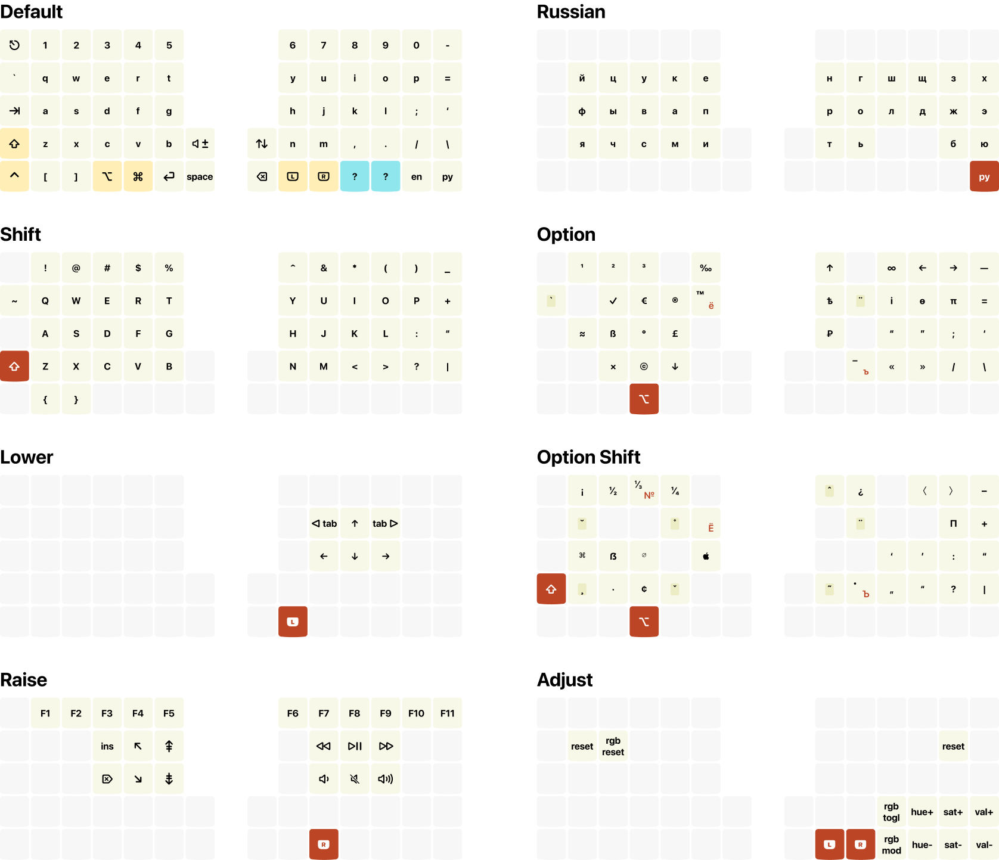
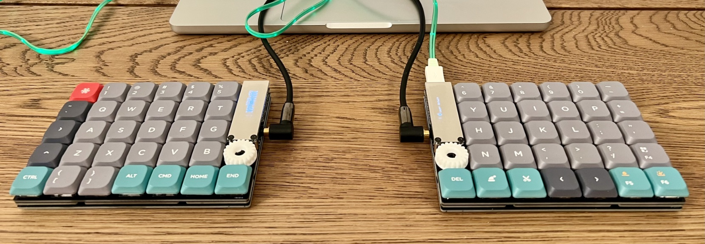

# Keymap & EN/RU layouts for Helix 60% split keyboard



## Building keymap

Following docs.qmk.fm/#/newbs_getting_started:

```
brew install qmk/qmk/qmk
qmk setup
```

Then

```
cd ~/ws
git clone git@github.com:tonsky/Helix-Layout.git
ln -s ~/ws/Helix-Layout/keymap ~/qmk_firmware/keyboards/helix/rev2/keymaps/tonsky
qmk compile -kb helix/rev2 -km tonsky
```

Download [QMK Toolbox.app](https://github.com/qmk/qmk_toolbox/releases). In the app:

- Local file -> Open `~/qmk_firmware/helix_rev2_tonsky.hex`
- MCU: `atmega32u4`
- Auto-flash: `checked`
- Press reset switch on the keyboard
- Repeat for the second half

## Layout

Layout and keymap work together to put keys where I want them, when possible. This is EN/RU layout, which led to some compromises.

- `EN` sends F13, `РУ` sends F14.
- Option layout mostly compatible with [Ilya Birman Typography Layout](https://ilyabirman.ru/projects/typography-layout/).
- Some of the principles from [github.com/tonsky/Universal-Layout](https://github.com/tonsky/Universal-Layout) apply.
- Navigation arrows do not require Karabiner.

## The physical device



## Where to buy

[yushakobo.jp/shop/helix-keyboard-kit/](https://yushakobo.jp/shop/helix-keyboard-kit/)